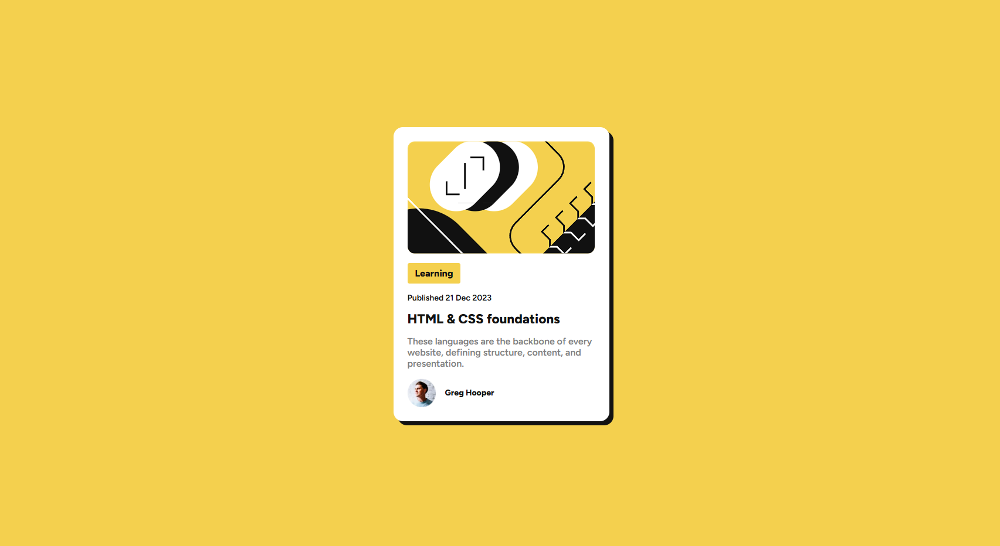

📝 Blog Preview Card

A responsive Blog Preview Card built as part of a Frontend Mentor challenge.
This project focuses on recreating a clean card-based UI using HTML and CSS, with attention to layout, typography, and hover interactions.

🚀 Features

- Modern card-based UI
- Blog article preview layout
- Author section with avatar
- Hover interaction effects
- Clean typography and spacing
- Responsive centered layout

| Technology       | Purpose                 |
| ---------------- | ----------------------- |
| **HTML5**        | Semantic page structure |
| **CSS3**         | Styling and layout      |
| **Flexbox**      | Layout alignment        |
| **GitHub Pages** | Deployment              |

📸 Screenshot

